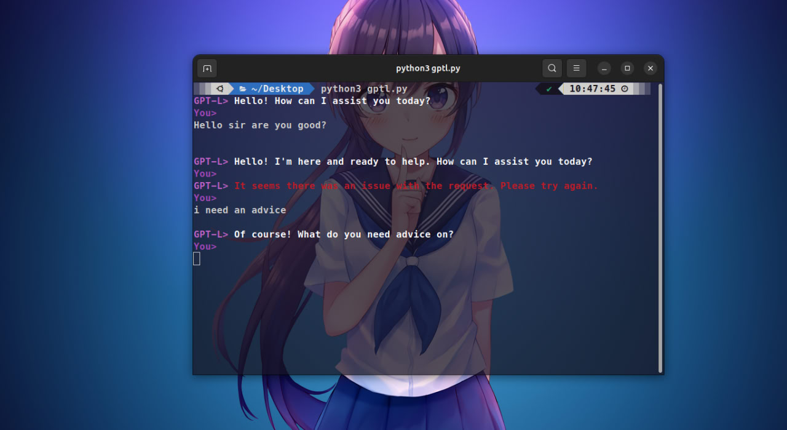

GPT-L Console Assistant
=======================

!REMEMBER DOUBLE ENTRE TO SEND TEXT !!!

What's New in This Version?
---------------------------

1. **HTML Response Handling**
   - **Before**: The bot would just dump raw HTML if the API returned it instead of regular text. Super messy.
   - **After**: I added a check so that if the response is HTML (like starting with `<!DOCTYPE html>`), it shows a proper error message instead of just displaying a bunch of raw code.

2. **Error Handling Got Better**
   - **Before**: The error messages were pretty vague, and sometimes the script would crash or freeze up.
   - **After**: Now, if there's an HTTP error, network issue, or timeout, the bot gives you more helpful messages to guide you. It won't leave you hanging.

3. **Smoother User Interaction**
   - **Before**: The UI worked, but it wasn’t super friendly or polished.
   - **After**: I cleaned it up, so now the responses are more structured, and you get better feedback on what’s happening. Basically, it’s a lot easier to talk to GPT-L now!

4. **Code Is Much Cleaner**
   - **Before**: There were a lot of extra things, like loading animations, that complicated the logic.
   - **After**: I got rid of unnecessary parts and simplified the whole thing. Less clutter, better flow. Easier to maintain, too!

New Features
------------

- **Interactive Help**: Type `help` to get a list of commands and how to use the assistant. No more guessing!
- **Better Error Handling for Network Issues**: If there’s a problem with your internet or the API, the bot now tells you exactly what’s wrong (e.g., "Connection failed. Check your internet connection").
- **Multi-line User Input**: You can now type more complex queries across multiple lines, and GPT-L will respond properly. No more getting cut off mid-sentence!

