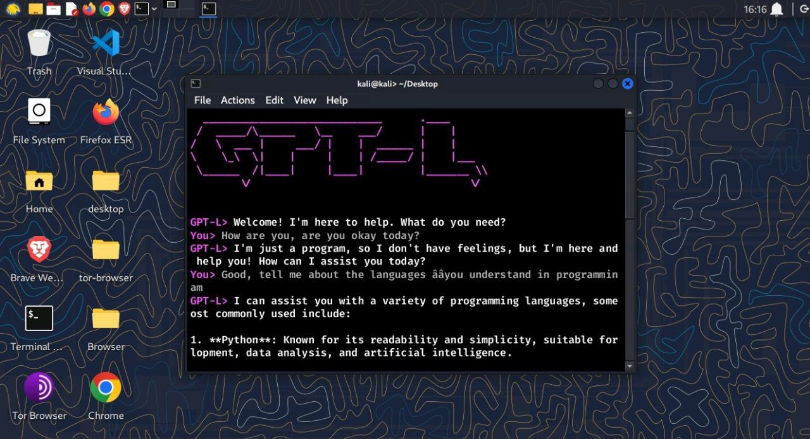

# 🌟 **GPTL.py - Chat GPT for Terminal** 🌟

Welcome to **GPTL.py**, a simple yet powerful implementation of **Chat GPT** designed specifically for terminal emulators on **Linux** and **Windows**.  
💬 Experience smooth **conversation formatting**, **typing animations**, and an intuitive interface all from your terminal!

---

## ✨ **Features**
- 🎨 **Elegant interface** with well-structured conversation formatting.
- ✍️ **Typing animations** for a more realistic chat experience.
- ⚙️ **Cross-platform support** for Linux and Windows.
- 🌈 **Colorful highlights** for better readability.
- 🔒 **Lightweight and secure**, optimized for terminal use.

---
